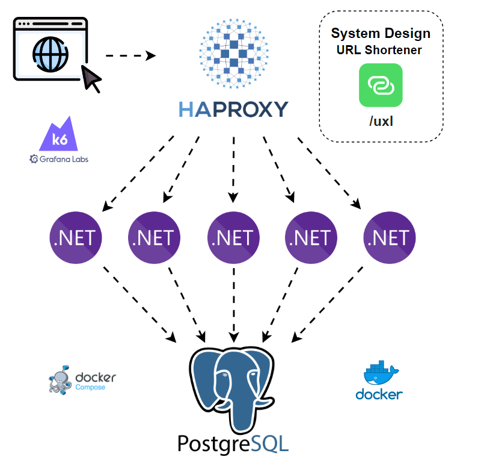

# UXL

Desenhe um Encurtador de URL

## 1 - Entendendo o problema e o escopo

- Dado uma URL qualquer, o sistema deve retornar uma versão curta dela
- Ao clicar na URL encurtada, deve ser redirecionado pro link original
- Os caracteres permitidos são (0-9, a-z, A-Z)
- Não é permitido deletar em editar uma URL
- Por questão de analytics, sempre redirecionar usando status code 302
- 100 milhões de URLS são geradas por dia:
    - 1160 inserts/s
    - 11.600 reads/s (assumindo 10:1)
    - 36.5 bilhões/ano

## 2 - Design de alto nível

- POST /urls
    - body com a URL original
    - retorna o hash da URL encurtada

- GET /target/{hash}
    - retorna a URL original

## 3 - Design de baixo nível

- São 62 caracteres permitidos, vamos usar um hash de tamanho 7:
    - 62^7 = 3,521,614,606,208 = ~3.5 trilhões

## 4 - Wrap up

- Adicionar rate limiter
- Database replication and sharding
- Analytics: how many clicks? when?
